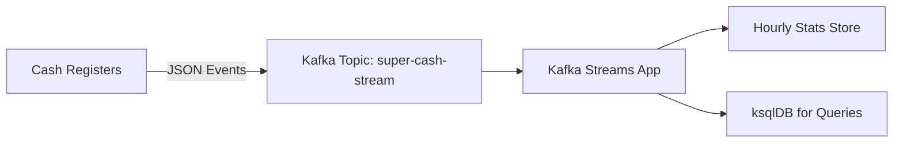

# 🛒 Super Cash Stream – Exercise
## Objective
Build a real-time data pipeline for a supermarket cash flow system using Apache Kafka. The goal is to ingest events from multiple cash registers, stream them through Kafka, and process them to produce hourly statistics.

## Requirements

1. Event Source
Each cash register sends events in real time with the following fields:

- timestamp (ISO format)
- shop_id
- order_id
- product_id
- quantity
- unit price

Example event:
```json
{ "shop_id": "S123",  "order_id": "O98765",  "product_id": "P456",  "quantity": 2,  "price": 4.99}
```

2. Ingestion System

Accept events from registers.
Send them to a Kafka topic (e.g., super-cash-stream).

3. Streaming System

Use Kafka Streams to process events.
Compute real-time stats on a 1-hour tumbling window, such as:

- Total revenue per shop.
- Total quantity sold per product.



Bonus

Add a ksqlDB query to perform the same aggregation using SQL-like syntax.
 

To Add
docker run -it -v super-cash-stream_super-cash-stream_data:/data ubuntu

cd /data
echo '{ "shop_id": "S123",  "order_id": "O98765",  "product_id": "P456",  "quantity": 2,  "price": 4.99}' >> pvtest.jsonl

To create sql
docker exec -it ksqldb-cli ksql http://ksqldb-server:8088

CREATE STREAM cashflow_stream (timestamp DOUBLE, shop_id VARCHAR, order_id VARCHAR, product_id VARCHAR, quantity INT, price DOUBLE) WITH (KAFKA_TOPIC='cashflow', KEY_FORMAT='KAFKA', VALUE_FORMAT='JSON')

SELECT product_id, quantity, price, (price * quantity) as revenue FROM cashflow_stream EMIT CHANGES
    